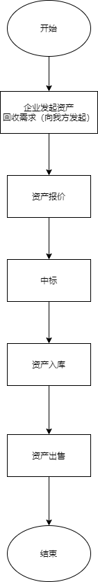
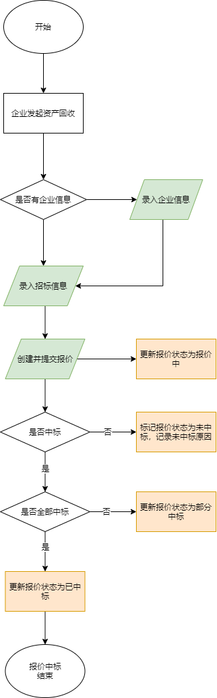
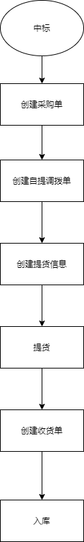
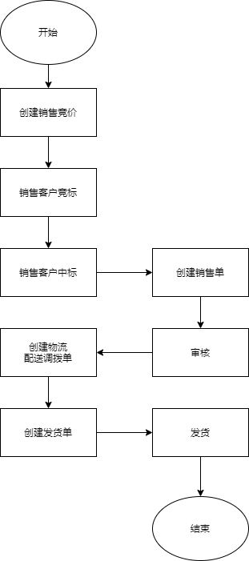

# 概要说明

首先项目的主要角色是将资产回收并转售的一个整体的业务。

主要的流程图如下：

其中企业发出资产回收请求，企业指的是提供二手资产的供应商，企业向多个资产回收方（采购方，包括我方）发出回收申请，采购方开始同时进行报价，企业开始评估并招标，如果我方中标了，就可以进行资产入库，然后等待出售。

## 资产报价中标流程

供应商在进行回收请求投标时，需要记录供应商的投标信息，然后对投标信息进行报价，然后进行报价跟进，查看是否有中标。

## 资产入库流程

## 资产出售流程

上面的四个是整体的主要的业务流程。

