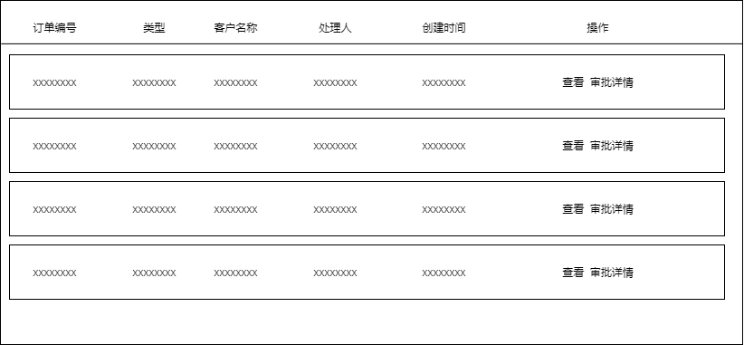

# 首页

## 1. 主要展示

主要是展示**采购单、销售单、调拨单**的数量，其中，他们都是按照对应订单的状态来进行分类展示统计的。

**工作流**状态
1. 审核中

**报价单**状态
1. 待提交
2. 报价中

**待收货**状态
1. 待收货
2. 已签收
3. 生产完成
4. 部分入库

**采购单**状态：
1. 待提交
2. 审核中
3. 采购中
4. 待报价
5. 未支付
6. 部分支付

**销售单**状态：
1. 待提交
2. 审核中
3. 代发货
4. 待收货
5. 未支付
6. 部分支付

**调拨单**状态
1. 待提交
2. 待审核
3. 代发货
4. 待收货

也就是针对于采购单，需要获取待提交的采购单的数量，审核中的采购单的数量，采购中的采购单数量，待报价的采购单数量，待支付的采购单数量，部分支付的采购单数量，并且显示在页面中。

**优化需求**
在鼠标移动到对应的模块上显示对应的模块说明

## 2. 模块点击

### 2.1 工作流-待审核

**工作流信息**

| 字段 | 类型 | 说明 |
| --- | --- | --- | --- |
| orderCode | string | 订单编号 |
| type		| string | 类型		|
| clientName| string | 客户名称	|
| oprUser	| string | 处理人	|
| createTime| date	 | 创建时间	|

**操作**

查询
审批详情

**原型图**

## 3. 系统公告

系统公告主要是展示系统的一个版本迭代的更新优化内容的列表。

