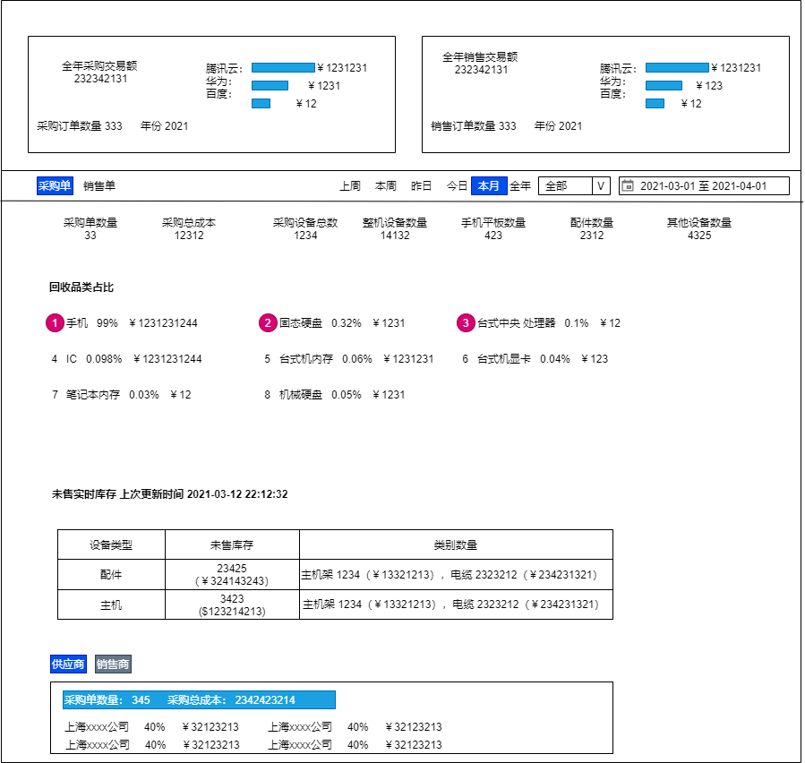

# 统计管理

## 数据统计

### 功能点击

1. 点击 **全年采购交易额**，可进入查看采购列表数据；
2. 点击 **全年销售交易额**，可进入查看销售列表数据；
3. 可查询指定时间内的采购单，销售单的统计数据；
4. 

## 采销数据统计

采销数据统计主要是针对于各种销售数据进行筛选搜索查询并且可以查看销售单详情。

| 销售日期 | 销售价格 | 销售客户 | 业务员 | 操作 |
| -------- | -------- | -------- | ------ | ---- |
| 2021-02-21 | ￥100.00 | 上海电子公司 | 王五 | [查看](#store_detail) |

### 库存详情

展示库存资产的详细信息，展示一下几方面信息：

**采购信息**
 - 采购单编号
 - 客户采购单编号
 - 供应商
 - 采购单状态
 - 采购单价
 - 采购创建人
 - 创建时间
 - 订单来源

**销售信息**
 - 销售单编号
 - 订单所属公司
 - 销售客户
 - 销售单状态
 - 销售单价
 - 销售单创建人
 - 创建时间

**竞价信息**
 - 竞价单编号
 - 创建人
 - 竞价单名称
 - 竞价单状态
 - 创建时间
 - 备注

**基本信息**
 - 条形码
 - 所属公司
 - 所属仓库
 - 具体位置
 - 入库时间
 - 发货时间
 - 类别
 - 制造商
 - 检验人

**配置信息**
 - 型号
 - CPU型号
 - 内存容量
 - 外观
 - 键盘
 - 屏幕
 - 显卡
 - 备注
 - 硬盘容量
 - 光驱
 - 异常情况
 - 电池

