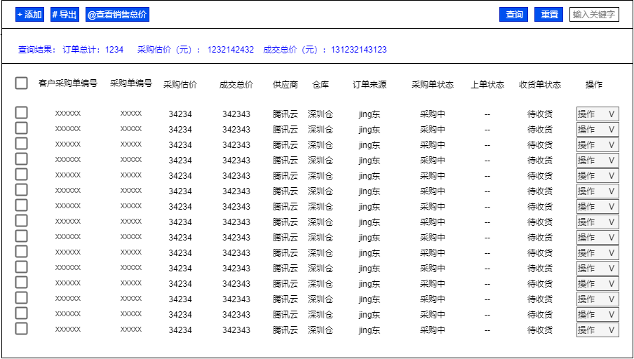
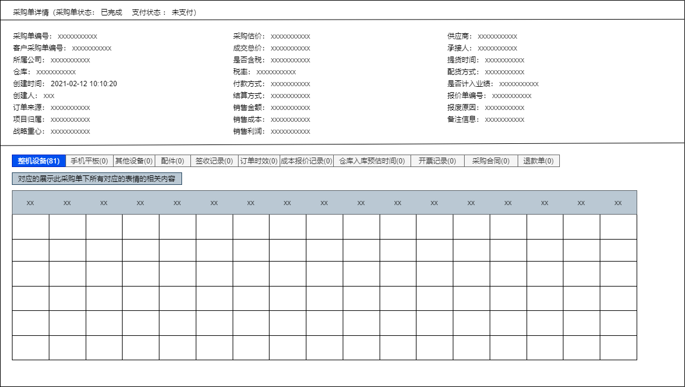

# 采购管理

采购管理是指针对于中标后的资产进行一个收货和入库管理过程。

## 采购单

### 操作

**查询采购单详情**

**添加采购单**
创建采购单，创建采购单可能有三种方式：
- 有报价单，有提货工单
- 有报价单，无提货工单
- 无报价单，无提货工单

**导出采购单**

导出相应查询到的采购单列表。

**查询销售总价**

查询针对于这批采购单的相应地销售总额。

## 提货单

添加了采购单之后，需要开始创建提货单，开始进行中标资产的提货。

### 操作
**查询提货列表**
**查看提货详情**
**立即提货**

修改提货状态为已提货

## 收货通知单 

进行提货调度后，回收到资产，需要进行收货登记处理。
收获通知单状态： 

**待收货/已入库/部分入库/已签收/生产完成/已作废**
收获通知单类型

**采购收货/退货收货/调拨收货**

操作：

**查看收货通知单列表**

**查看收货通知单详情**

**确认签收**

对已经到货的资产进行确认签收

**下载客户设备清单**

**修改仓库**

