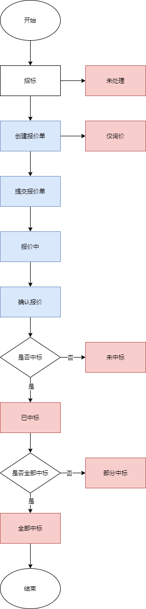

# 报价管理

## 人工报价

人工报价是指针对于供应商的招标进行资产的报价管理，创建报价单。

### 报价单的中标状态说明

**未处理**

已经过了报价期限，但是还未更新中标状态的报价单。

**已中标**

供应商的招标资产全部中标。

**未中标**

**仅询价**

**部分中标**

### 报价单报价状态说明

**待提交**

**报价中**

**已报价**

**已取消**

### 操作

**查询报价单列表**

**查看报价单详情**

**修改项目归属地**

**报价完成**

**强制取消**

**修改最终报价**

**更新中标状态**

